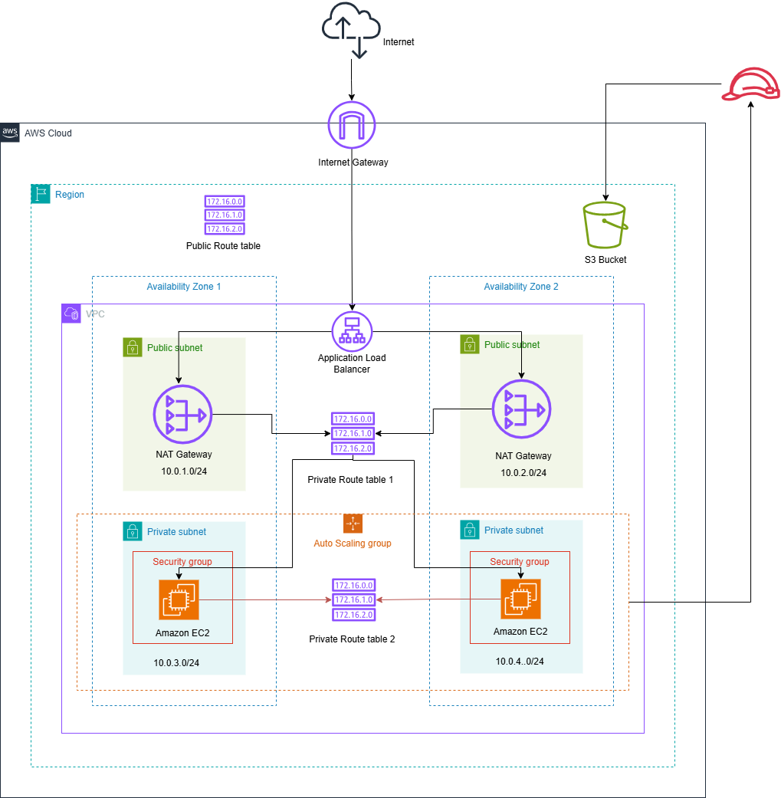

# Udagram: Deploying a High-Availability Web App Using AWS CloudFormation

## Architecture Overview

The infrastructure includes the following components:

1. **Networking**:
   - A Virtual Private Cloud (VPC).
   - Two public subnets and two private subnets for high availability across different Availability Zones.
   - An Internet Gateway to enable internet access for public subnets.
   - Two NAT Gateways to allow private subnets access to the internet for outbound traffic.

2. **Compute Resources**:
   - An AutoScaling group with four EC2 instances (t2.micro, Ubuntu 22) distributed across two private subnets.
   - A Launch Template that defines the configuration for EC2 instances.
   - An Application Load Balancer in the public subnets, routing traffic to the EC2 instances in private subnets.

3. **Security Groups**:
   - A security group for EC2 instances allowing inbound HTTP (port 80) traffic and unrestricted outbound internet access.
   - A security group for the Load Balancer allowing public traffic on port 80.

4. **Storage**:
   - An S3 bucket for storing static content, with public-read access. The EC2 instances have read and write permissions to this bucket.

## Pre-requisites
Before running the CloudFormation templates, ensure you have the following set up:

1. AWS CLI configured with the necessary permissions.
2. A key pair created in the AWS region you are deploying the infrastructure.
3. CloudFormation templates ready and parameter files prepared.

## Instructions

### 1. Deploying the Network Stack
First, create the networking infrastructure by running the following command:

```bash
./create.sh udacity-network file://cloudformation/network.yml file://cloudformation/network-params.json
```

This will deploy a VPC, subnets, Internet Gateway, and NAT Gateways.

### 2. Deploying the Application Stack
Once the network stack is up, deploy the application infrastructure:

```bash
./create.sh udacity-server file://cloudformation/server.yml file://cloudformation/server-params.json
```

This command will create the AutoScaling group, EC2 instances, Load Balancer, and S3 bucket.

### 3. Verifying the Deployment
After the application stack is created, you can find the public URL of the Load Balancer in the CloudFormation outputs. Navigate to this URL in your browser, and you should see a message saying:

```
URL to verify installation: `http://udacit-webap-eg1baj3ttzjt-1614684306.us-east-1.elb.amazonaws.com/`
```

### 4. Deleting the Infrastructure
When you're done with the infrastructure, run the following commands to clean up the resources and avoid unwanted charges:

1. Delete the application stack:
```bash
./delete.sh udacity-server
```

2. Delete the network stack:
```bash
./delete.sh udacity-network
```

Note: Ensure that you empty the S3 bucket before deleting the stack to avoid any deletion issues.

## Diagrams
Include a diagram that outlines the architecture of your solution, including network, compute resources, and the relationships between them.

